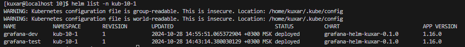
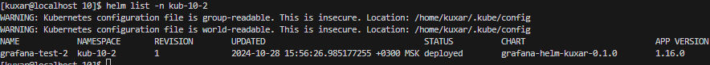

# kuber-10-HELM

Задание 1. Подготовить Helm-чарт для приложения
Необходимо упаковать приложение в чарт для деплоя в разные окружения.
Каждый компонент приложения деплоится отдельным deployment’ом или statefulset’ом.
В переменных чарта измените образ приложения для изменения версии.
Задание 2. Запустить две версии в разных неймспейсах
Подготовив чарт, необходимо его проверить. Запуститe несколько копий приложения.
Одну версию в namespace=app1, вторую версию в том же неймспейсе, третью версию в namespace=app2.
Продемонстрируйте результат.

#### Задание 1.
Устанавливаю helm
```
sudo snap install helm --classic
```
Создаю чарт
```
helm create grafana-helm-kuxar
```
[values_dev.yaml](yaml/values_dev.yaml)
[values_test.yaml](yaml/values_test.yaml)
[values_test_2.yaml](yaml/values_test_2.yaml)

#### Задание 2.
```
kubectl create namespace kub-10-1
```
УСтанавливаю два чарта с графаной в первый namespace
```
helm install grafana-test grafana-helm-kuxar/  --values 10-1/values_test.yaml -n kub-10-1
helm install grafana-dev grafana-helm-kuxar/  --values 10-1/values_dev.yaml -n kub-10-1
```
Проверка
```
helm list -n kub-10-1
```


```
kubectl create namespace kub-10-2
```

```
helm install grafana-test-2 grafana-helm-kuxar/  --values 10-2/values_test_2.yaml -n kub-10-2helm list -n kub-10-2
```
```
helm list -n kub-10-2
```


